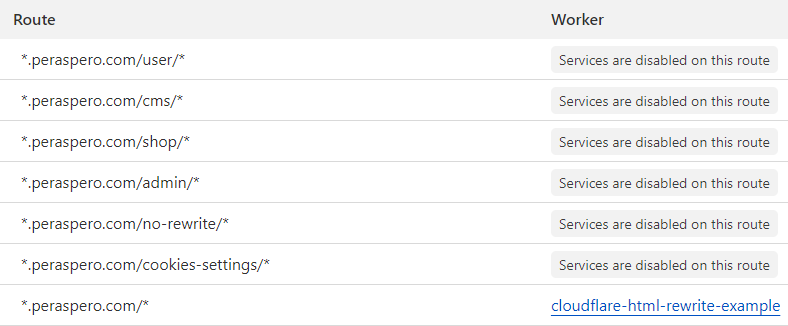

# Rewriting HTML on Cloudflare

## Motivation
When customizing Shoptet projects with code, one of the limitations is the inability to manipulate the HTML outside of dedicated fields (e.g. global `<head>` code). Using Cloudflare as a proxy opens up this possibility. With [Cloudflare Workers](https://developers.cloudflare.com/workers/) and [Workers Routes](https://developers.cloudflare.com/workers/configuration/routing/routes/), it is possible to programmatically modify the HTML before it reaches the user. The purpose of this package is to provide a starting point for developing customization workers.

Benefits of using Cloudflare workers for HTML rewriting include
- Avoid flashing and moving elements due to client-side JavaScript customizations.
- Less burden on client devices. This is especially noticeable on older mobile devices or on slow networks, where client-side JavaScript customizations inadvertently increase page load times.

One potential drawback is that the browser must wait a bit longer for the HTML document itself. However, this time can be minimized to tens of milliseconds.

## Start with a simple local setup

This will give you a simple Cloudflare Worker that can be run locally:

- Requirements:
  - Node.js installed on your system
- Clone this repo and navigate to its root directory
- Run `npm i`.
- Set up local env variables: `cp .dev.vars.example .dev.vars`.
- Run `npm run dev:local` Due to Cloudflare restrictions, you must use `npm run dev:remote` when developing against the site that is already using Cloudflare as a proxy.
- At http://localhost:8787/ you should see a modified showcase project https://classic.shoptet.cz/ The project can be switched in `.dev.vars`.
- You can play around with `src/index.ts` and see your changes applied.

## Production use

- Requirements:
   - Shoptet project using Cloudflare as proxy (see [Shoptet docs](https://podpora.shoptet.cz/hc/cs/articles/7128655751826-Cloudflare))
   - Cloudflare account with access to project's Cloudflare dashboard
- Run `npm run dev:remote` for local development.
- Run `npm run deploy` to deploy using Wrangler.
- Once you have deployed the worker, set up Workers Routes in the Cloudflare dashboard. This tells Cloudflare which routes to trigger your worker on. It is important to exclude common system routes, assets, etc. to save resources and prevent unexpected behavior.

Example setting of Workers Routes (see [docs](https://developers.cloudflare.com/workers/configuration/routing/routes/) for details):

## Parsing the entire document vs HTMLRewriter
This example uses [node-html-parser](https://www.npmjs.com/package/node-html-parser), which parses the entire HTML document into memory. It offers similar possibilities as DOM manipulation in the browser (`querySector` etc.). This makes it suitable for large changes in HTML documents. Average slowdown of TTFB with `node-html-parser` is about 50-70ms. We recommend it for most use cases.

Switch to the `with-html-rewriter` branch to use Cloudflare's own [HTMLRewriter](https://developers.cloudflare.com/workers/runtime-apis/html-rewriter/). Its main appeal is that it rewrites HTML while streaming the response, making it faster in comparison to libraries like `node-html-parser` or `cheerio`. On the other hand, its modifying capabilities are limited. For example, by definition, you cannot change an element based on another element further down in the HTML document, because the former is already sent to the user when the latter is processed. The average slowdown of TTFB with HTMLRewriter is about 15ms. We recommend it for cases where only very simple HTML changes are required.

## Possible future enhancements of this starter
- Adding livereload to `dev:remote` (currently not available)
- Example of developing and deploying worker together with client-side customizations (JavaScript and CSS) in an unified workflow. This is doable since Cloudflare Workers can serve static assets.
- Deployment with GitHub actions
